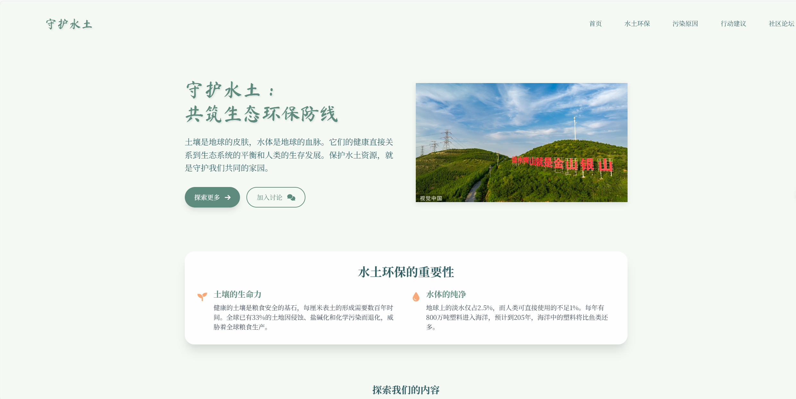
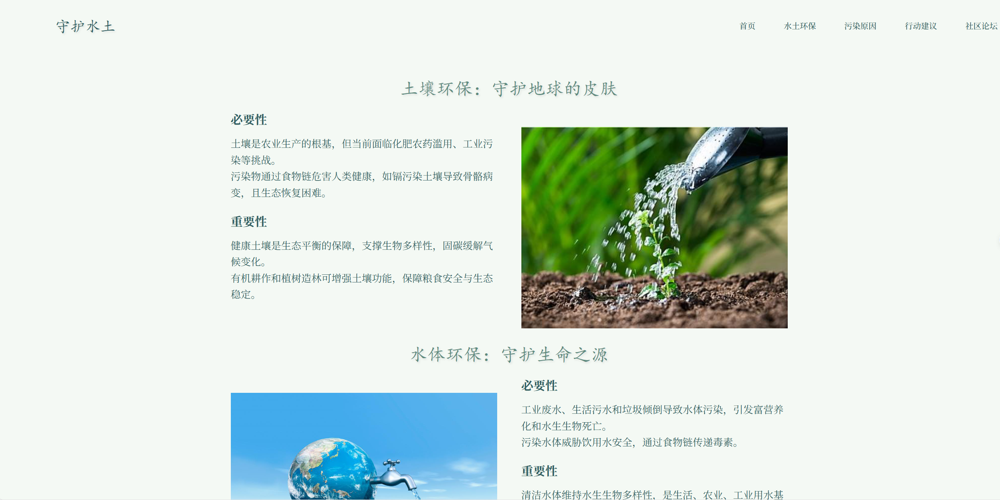
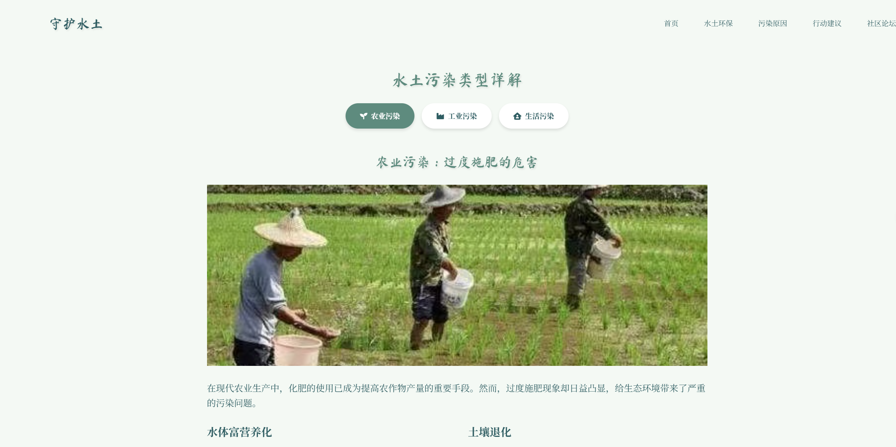
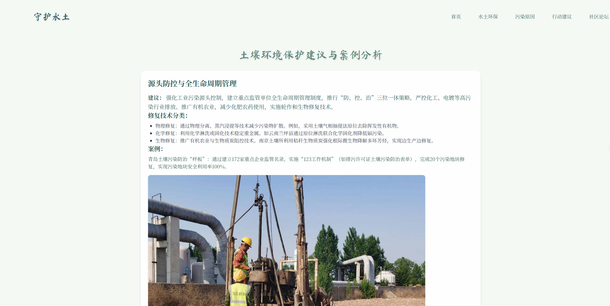
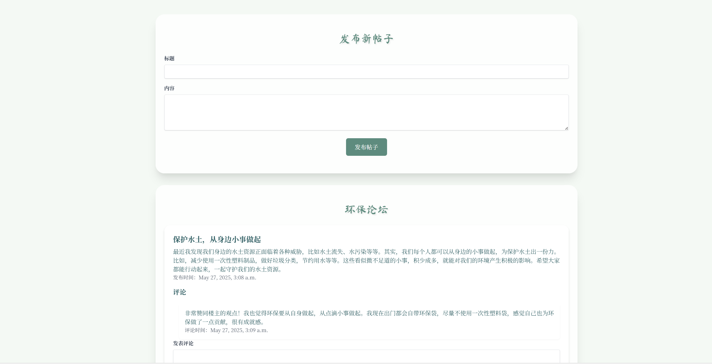

# Environmental-themed-Website

## 小组成员：

- 魏汶桦  2024303120168  资源与环境学院  农业工程与信息技术
- 郑    锦  2024303110018  资源与环境学院  生态学
- 陈    悦  2024303120137  资源与环境学院  资源利用与植物保护
- 慕淇燕  2024303110003  资源与环境学院  生态学
- 王雨兰  2024303110069  资源与环境学院  土壤学

## 网站介绍：

1. ### 首页：

   ​        水土资源是大自然的珍贵礼物，是生态系统的核心组成部分。守护水土就是守护我们赖以生存的家园，呼吁大家携手共筑生态环保防线，为自己和子孙后代创造美好的生态环境。

   
   

3. ### 水土环保：

   ​        水土保持是维持生态系统平衡的核心环节，水土保持能增强生态系统韧性，通过植被固坡、土壤蓄水等功能，缓冲极端气候影响，维持碳汇能力，为野生动植物提供稳定生境，是防范生态退化、构建人与自然和谐共生格局的关键生态屏障。通过科普，公众能深入理解水土资源对生态系统的基础支撑作用，知晓水土流失导致的生物栖息地破坏、水质恶化等连锁效应，破除 “水土问题与己无关” 的认知盲区。

   

5. ### 污染原因：

   ​        当前环境面临的三大主要污染源，包括工业污染、农业过度施肥污染和生活污染。工业污染源于工厂排放的废气、废水和废渣，含有有害物质，破坏生态系统和影响人类健康；农业过度施肥导致土壤酸化、水体富营养化等问题，影响生物多样性和农产品质量；生活污染排放量大、处理难度高，污染水体和空气并传播疾病。这些污染源相互交织，加剧了环境压力。因此需要采取综合措施，加强工业排放监管、推广科学施肥技术、提高生活垃圾分类和处理能力，以实现经济、社会与环境的协调发展。

   

7. ### 行动建议：

   ​        在工业领域，推广清洁生产技术和循环经济模式，减少重金属、有机物等有害物质对土壤和水体的渗透；在农业领域，推广精准施肥技术，结合土壤检测数据调整化肥用量，避免过度施肥导致土壤酸化或水体富营养化。实施轮作休耕制度并采用生物修复技术治理受污染农田；在生活领域，完善生活垃圾分类体系，重点回收有害垃圾，减少有毒物质进入土壤和水体。建设分散式污水处理设施，避免生活污水直排河道，推广雨水花园、生态滤池等自然净化技术。

   

9. ### 社区论坛：

   ​        在社区论坛广大群众可以讨论自己的一些环境保护观点和建议措施来改善环境保护水土。

   

11. ### 开发技术：

   ​        网站使用Django框架开发。Django Migrations进行数据库迁移；使用缓存策略和异步任务来优化性能；采用Docker容器化部署和Sentry进行日志监控；前端进行静态资源打包；项目整体采用分层架构开发，实现高内聚低耦合的架构，确保系统稳定性。

